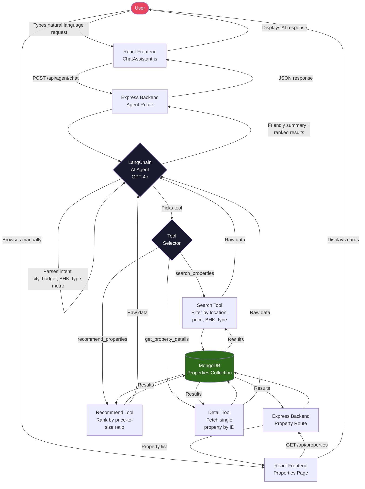

# AI Real Estate Platform

A full-stack real estate platform where users find properties through natural language conversation instead of manual filters. Built with React, Node.js, MongoDB, and a LangChain AI agent powered by GPT-4o.

## What It Does

Instead of clicking through dropdowns, users just describe what they want:

> "Show me 2BHK apartments in Hyderabad under ₹40 lakhs near a metro station"

The AI agent understands the request, queries MongoDB, and returns ranked results — no filters touched.

## Tech Stack

| Layer | Technology |
|-------|-----------|
| Frontend | React.js, React Router |
| Backend | Node.js, Express.js |
| Database | MongoDB, Mongoose |
| AI Agent | LangChain, GPT-4o (OpenAI) |
| Auth | JWT (JSON Web Tokens) |
| HTTP | Axios, REST APIs |

## Project Structure

```
ai-real-estate/
├── backend/
│   ├── src/
│   │   ├── agent/
│   │   │   ├── agent.js          # LangChain agent setup
│   │   │   └── tools.js          # search, recommend, detail tools
│   │   ├── controllers/
│   │   │   ├── agentController.js
│   │   │   ├── authController.js
│   │   │   └── propertyController.js
│   │   ├── models/
│   │   │   ├── Property.js       # schema + compound indexes
│   │   │   └── User.js
│   │   ├── routes/
│   │   │   ├── agent.js
│   │   │   ├── auth.js
│   │   │   └── properties.js
│   │   ├── middleware/
│   │   │   └── auth.js           # JWT guard
│   │   ├── config/
│   │   │   └── db.js
│   │   ├── app.js
│   │   └── server.js
│   ├── seed.js                   # sample property data
│   └── .env.example
└── frontend/
    └── src/
        ├── pages/
        │   ├── Home.js
        │   ├── Properties.js
        │   ├── PropertyDetail.js
        │   ├── ChatAssistant.js  # main AI chat interface
        │   ├── Login.js
        │   └── Register.js
        ├── components/
        │   ├── Navbar.js
        │   └── PropertyCard.js
        ├── context/
        │   └── AuthContext.js
        ├── services/
        │   └── api.js            # Axios wrappers
        └── App.js
```

## System Flow Diagram



## How the AI Agent Works

The agent has three tools it can call autonomously:

- **search_properties** — filters by city, area, BHK, price range, type, metro proximity
- **recommend_properties** — ranks by best price-to-size value for a given city and budget
- **get_property_details** — fetches full details for a specific property ID

The agent can chain these tools in a single response — for example, first searching by location, then recommending the best value options.

## Getting Started

### Prerequisites

- Node.js 18+
- MongoDB (local or Atlas)
- OpenAI API key

### 1. Clone the repo

```bash
git clone <repo-url>
cd ai-real-estate
```

### 2. Set up the backend

```bash
cd backend
npm install
cp .env.example .env
```

Edit `.env`:

```env
PORT=5000
MONGO_URI=mongodb://localhost:27017/ai_real_estate
JWT_SECRET=your_secret_here
OPENAI_API_KEY=sk-...
```

### 3. Seed the database

```bash
node seed.js
```

This loads 8 sample properties across Hyderabad, Bangalore, and Pune.

### 4. Start the backend

```bash
npm run dev
```

Backend runs on `http://localhost:5000`

### 5. Set up the frontend

```bash
cd ../frontend
npm install
npm start
```

Frontend runs on `http://localhost:3000` and proxies API calls to `:5000`.

## API Endpoints

### Auth

| Method | Endpoint | Description |
|--------|----------|-------------|
| POST | `/api/auth/register` | Create account |
| POST | `/api/auth/login` | Login, returns JWT |

### Properties

| Method | Endpoint | Description |
|--------|----------|-------------|
| GET | `/api/properties` | List with filters (city, type, bhk, price) |
| GET | `/api/properties/:id` | Single property detail |
| POST | `/api/properties` | Create listing (seller/admin only) |
| DELETE | `/api/properties/:id` | Delete listing |

### AI Agent

| Method | Endpoint | Description |
|--------|----------|-------------|
| POST | `/api/agent/chat` | Send message, get AI response |
| DELETE | `/api/agent/history/:sessionId` | Clear conversation |

### Example agent request

```json
POST /api/agent/chat
{
  "message": "2BHK in Hyderabad under 40 lakhs near metro",
  "sessionId": "user_session_123"
}
```

## Example Queries to Try

```
2BHK apartment in Hyderabad under ₹40 lakhs near a metro
3BHK villa in Bangalore with gym and pool under ₹1.2 crore
Best value flats in Pune under 60 lakhs
Show me all apartments in Hitech City
What are the cheapest 1BHK options in Hyderabad?
```

## MongoDB Schema Highlights

**Property** — compound index on `(city, price, type, bhk)` for fast filtered queries:

```js
{
  title, description, type, bhk, price,
  location: { city, area, pincode, nearMetro },
  area: { size, unit },
  amenities: [String],
  available: Boolean
}
```

**User** — roles: `buyer`, `seller`, `admin`. Passwords hashed with bcrypt.

## User Roles

| Role | Permissions |
|------|------------|
| buyer | Browse, search, use AI assistant |
| seller | All buyer permissions + create listings |
| admin | All permissions + delete any listing |
